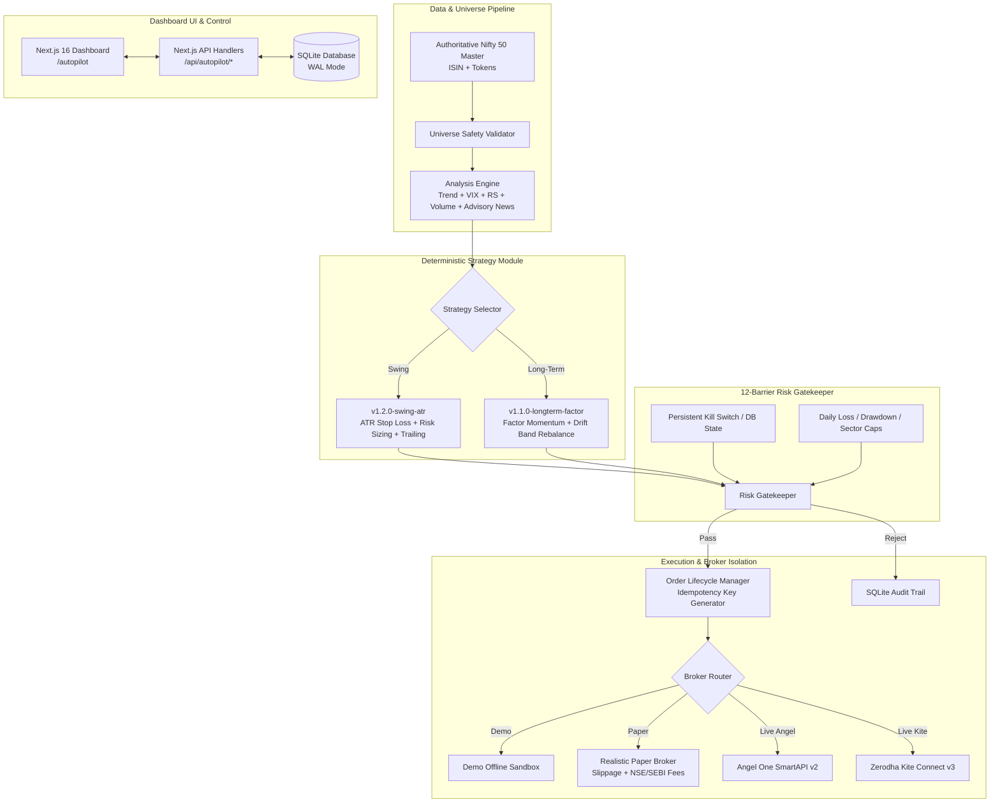

# NIFTY 50 AUTOPILOT — System Architecture & Operations Manual

## 1. Executive Summary

**NIFTY 50 AUTOPILOT** is an institutional-grade, risk-gated quantitative automation engine built specifically for **NSE Nifty 50 Cash Equities (EQ Segment)**. 

### Core Tenets
1. **Cash Equities Only**: Strictly restricted to the 50 constituent stocks of the Nifty 50 index. Derivative contracts (Options/Futures), Bank Nifty, Mid/Small caps, and crypto are hard-blocked at the universe level.
2. **Deterministic No-Trade Capability**: When market regime, volatility, factor momentum, or risk criteria fail, the engine issues explicit, logged `NO_TRADE` decisions.
3. **No False Claims**: Zero claims of guaranteed returns, price predictions, or guaranteed stop-loss execution. All simulations, backtests, and paper runs are explicitly watermarked.
4. **12-Barrier Independent Risk Gatekeeper**: Final authority to approve, resize, or reject every order before broker submission.
5. **Fail-Safe Broker Isolation**: Live trading is strictly locked until explicit user confirmation and verified broker API credentials exist.

---

## 2. System Architecture



---

## 3. Module Breakdown

### 3.1 Universe Service (`src/lib/autopilot/universe/nifty50Universe.ts`)
- **Authoritative Source**: NSE India Nifty 50 constituent list (Index Maintenance Sub-Committee).
- **Metadata**: Symbol, Full Company Name, Sector, Weightage (%), ISIN, Angel One Token, Zerodha Instrument Token.
- **Fail-Safe Gate**: `validateUniverseSafety(symbol)` enforces:
  - Exact match against 50 approved symbols.
  - Rejection of non-equity suffixes (`-FUT`, `-CE`, `-PE`, `BANKNIFTY`, `NIFTY_FUT`).
  - Safe substring resolution (e.g., distinguishing "RELIANCE" from "CE" options).

### 3.2 Analysis Engine (`src/lib/autopilot/analysis/marketAnalysisEngine.ts`)
- **Market Regime**: Classified via 20/50 SMA slope and India VIX (`LOW_VOLATILITY`, `NORMAL`, `ELEVATED_VOLATILITY`, `HIGH_VOLATILITY_DEFENSIVE`).
- **Relative Strength**: 0–100 score normalized against Nifty 50 index benchmark.
- **Volatility & Bands**: ATR-14, RSI-14, 20-day Average Daily Volume.
- **Advisory News Classifier**: LLM/Heuristic news classification for advisory sentiment tagging with strict timestamps and source provenance. *Note: News is strictly informational and can NEVER trigger or authorize an order.*

### 3.3 Strategy Engine (`src/lib/autopilot/strategies/`)
- **Swing Strategy (`swingStrategy.ts`)**:
  - Entry on RS > 60 + RSI pullback (40–65) + 20 SMA confirmation.
  - Stop Loss: Fixed at $2.0 \times \text{ATR}_{14}$ below entry price.
  - Sizing:
    $$\text{Quantity} = \min\left(\left\lfloor \frac{\text{Capital} \times \text{RiskPerTrade\%}}{\text{Entry} - \text{StopLoss}} \right\rfloor, \left\lfloor \frac{\text{MaxOrderValue}}{\text{Entry}} \right\rfloor, \left\lfloor \frac{\text{Cash}}{\text{Entry}} \right\rfloor\right)$$
  - Trailing Stop: Dynamically ratchet upwards upon reaching $1.5R$.
  - Transaction Costs: Deducts 0.1% STT, 0.00345% NSE turnover charge, 0.0001% SEBI fee, 0.015% stamp duty, 18% GST on brokerage, plus slippage modeling.
- **Long-Term Strategy (`longTermStrategy.ts`)**:
  - Top-10 momentum and quality factor basket.
  - Target weight: $10\%$ per constituent (capped by sector exposure $\le 25\%$).
  - Rebalance Trigger: Only if constituent weight drifts by $\pm 3\%$ from target.
  - No tight stop losses (avoids whipsaw in structural long-term holdings).

### 3.4 Risk Gatekeeper (`src/lib/autopilot/risk/riskEngine.ts`)
Evaluates 12 barriers before an order is allowed:
1. **Universe Check**: Strictly Nifty 50 constituent cash equity.
2. **Data Freshness**: Quotes older than max latency threshold are rejected as `STALE_DATA`.
3. **Capital & Funds Check**: Cash required must not exceed available broker margin.
4. **Per-Trade Risk Cap**: Max loss per trade strictly $\le \text{RiskPerTrade}\%$.
5. **Daily Loss Circuit Breaker**: Trading paused if daily loss reaches limit.
6. **Max Drawdown Circuit Breaker**: Auto-switch to defensive mode/pause if portfolio drawdown exceeds threshold.
7. **Max Open Positions**: Rejects new entries if position count is at capacity.
8. **Sector Concentration Limit**: Total exposure per sector capped (default: 25%).
9. **Single Position Exposure Cap**: Maximum capital in single stock capped (default: 15%).
10. **Duplicate Order Debounce**: Rejects identical symbol/side orders within 300 seconds.
11. **Max Slippage & Max Order Value**: Order value $\le \text{MaxOrderValue}$; price check within slippage tolerance.
12. **Persistent Kill Switch**: If engaged, blocks all new entries immediately.

### 3.5 Broker Adapters (`src/lib/autopilot/brokers/`)
- **`IBrokerAdapter` Interface**: Unified contract for auth, quotes, orders, positions, funds, and reconciliation.
- **`AngelOneAdapter`**: Native Angel One SmartAPI v2 implementation using TOTP authentication and feed tokens.
- **`ZerodhaAdapter`**: Kite Connect v3 REST client supporting session renewal and standard postbacks.
- **`PaperBrokerAdapter`**: Local simulation engine modeling market fills with realistic slippage, liquidity latency, and statutory Indian market taxes.
- **`DemoBrokerAdapter`**: Offline sandbox for exploration without external dependencies.

---

## 4. SEBI Regulatory & Exchange Compliance Guidelines

When operating automated trading systems in the Indian market (NSE/BSE), users and developers must comply with applicable regulations:

### 4.1 Exchange Algo Approvals & Non-PMS Disclaimer
- **Retail API Access**: Angel One SmartAPI and Zerodha Kite Connect provide retail API access for self-directed personal trading.
- **Algo Approval Requirements**: Under SEBI Circular `SEBI/HO/MRD/DP/CIR/P/2018/62` and NSE circulars, automated algorithms that execute without manual per-trade approval or run on co-location/broker servers generally require broker empanelment and exchange algorithmic approval IDs.
- **Mandatory Disclosures**:
  - This platform is **NOT a SEBI-registered Investment Adviser (RIA)** or **Portfolio Management Service (PMS)**.
  - All signals are generated algorithmically based on user-configured mathematical rules.
  - No representation of profit or risk immunity is made.

### 4.2 Static IP & Authentication Constraints
- **Static IP Requirement**: Many Indian brokers require static IP whitelisting for live API endpoints. If deployed on dynamic cloud infrastructure (e.g., standard Vercel serverless), outbound IP rotation will cause authentication rejections.
- **Solution**: Route broker traffic through a fixed proxy IP or run the dedicated worker (`scripts/autopilot-worker.ts`) on a VPS (e.g., AWS EC2, DigitalOcean) with an Elastic Static IP.
- **TOTP Requirement**: Angel One requires automated TOTP generation via secret keys (`ANGEL_ONE_TOTP_KEY`) to initiate daily sessions.

---

## 5. Deployment Architecture

### 5.1 Vercel Deployment (Frontend + API Routes)
- Next.js 16 app deployed on Vercel serves the Dashboard UI, configuration forms, backtest explorer, and manual cycle triggers (`/api/autopilot/cycle`).
- Serverless API routes connect to SQLite/Postgres to fetch state and rankings.

### 5.2 Dedicated Continuous Worker (`scripts/autopilot-worker.ts`)
Continuous market data feeds, multi-second heartbeat polling, and scheduled rebalance sweeps require a long-running daemon outside serverless time limits:

```bash
# Start standalone daemon worker
npx tsx scripts/autopilot-worker.ts
```

**Worker Lifecycle:**
1. Loads active configuration from DB.
2. Initializes broker session.
3. Every interval (default 30s during market hours 09:15–15:30 IST):
   - Synchronizes quotes for Nifty 50 constituents.
   - Evaluates active strategy (Swing / Long-Term).
   - Passes candidate orders to 12-barrier Risk Engine.
   - Executes approved orders via selected Broker Adapter.
   - Reconciles open positions and checks trailing stops.

---

## 6. Environment Variables Reference (`.env.example`)

| Variable | Description | Default / Example |
| :--- | :--- | :--- |
| `AUTOPILOT_MODE` | Default operating mode (`DEMO`, `PAPER`, `LIVE`) | `DEMO` |
| `AUTOPILOT_STRATEGY` | Active strategy (`SWING_MOMENTUM`, `LONG_TERM_FACTOR`) | `SWING_MOMENTUM` |
| `AUTOPILOT_LIVE_ENABLED` | Safety master switch for live order placement | `false` |
| `AUTOPILOT_BROKER` | Active broker adapter (`PAPER`, `ANGEL_ONE`, `ZERODHA`) | `PAPER` |
| `AUTOPILOT_DB_PATH` | Path to SQLite database file | `./data/autopilot_engine.db` |
| `ANGEL_ONE_API_KEY` | Angel One SmartAPI Developer Key | Required for Angel One |
| `ANGEL_ONE_CLIENT_CODE` | Angel One Client User ID | Required for Angel One |
| `ANGEL_ONE_PASSWORD` | Angel One Trading PIN / Password | Required for Angel One |
| `ANGEL_ONE_TOTP_KEY` | 32-character TOTP Secret | Required for Angel One |
| `ZERODHA_API_KEY` | Zerodha Kite Connect API Key | Required for Zerodha |
| `ZERODHA_API_SECRET` | Zerodha Kite Connect API Secret | Required for Zerodha |
| `ZERODHA_ACCESS_TOKEN` | Daily Generated Access Token | Required for Zerodha |

---

## 7. Step-by-Step Activation Guide

### Step A: Activating Paper Trading (Safe Simulation)
1. **Navigate to Autopilot**: Open `http://localhost:3000/autopilot` in your browser.
2. **Acknowledge Risk Notice**: Review and accept the SEBI risk disclosure.
3. **Configure Settings**:
   - Click **"Configure Strategy & Risk"**.
   - Mode: Select **"PAPER"**.
   - Strategy: Select **"Swing Momentum (ATR Risk)"** or **"Long-Term Factor Allocation"**.
   - Set Initial Capital (e.g., ₹500,000) and Per-Trade Risk (e.g., 1.0%).
   - Click **"Save Strategy Configuration"**.
4. **Trigger a Run**:
   - Click **"Run Autopilot Cycle"** to execute an on-demand market scan.
   - Inspect rankings, generated signals, risk audit logs, and simulated orders.

### Step B: Activating Live Trading (Prerequisites & Procedure)
1. **Broker Credentials**:
   - Create developer apps in your Angel One or Zerodha portal.
   - Configure credentials in `.env.local`.
2. **Static IP Configuration**: Ensure outbound worker IP is registered in broker portal.
3. **Master Live Switch**: Set `AUTOPILOT_LIVE_ENABLED="true"` in `.env.local`.
4. **Switch UI Mode**: In the Autopilot Config Modal, switch mode to **"LIVE"** and select your broker.
5. **Approval Mode (Recommended)**: Enable **"Require Approval Before Execution"** so every trade generates a `PENDING_APPROVAL` order requiring manual authorization.
6. **Kill Switch Readiness**: Verify the **Emergency Kill Switch** button is visible and functional on the top header.
